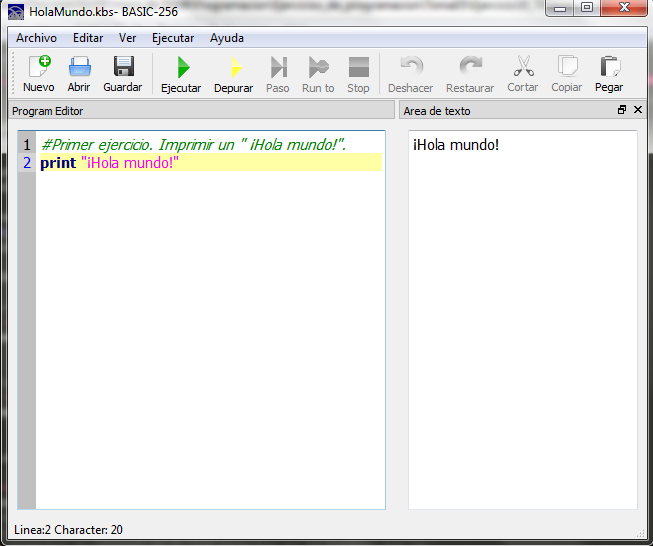
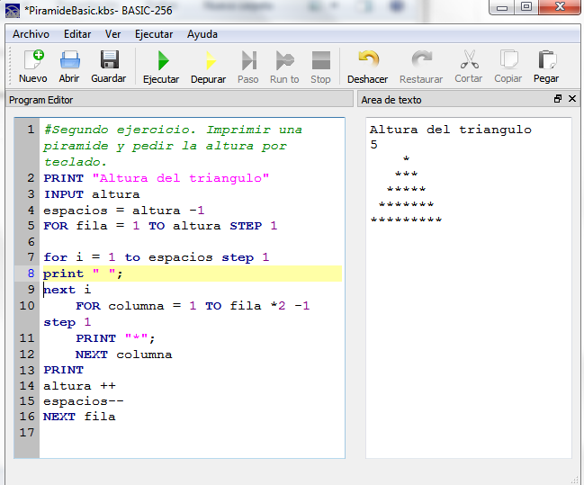
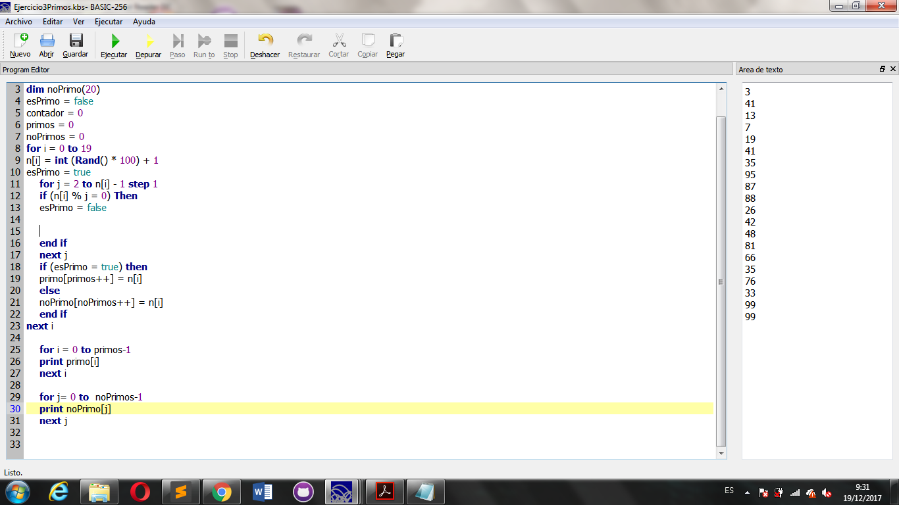

# Aprende un lenguaje de programación en un día (ejercicio voluntario para subir nota).


## Miembros del grupo

## Miembros del grupo: "BASICEUD"
* Viktoriia Stasiuk
* Pablo Pinto Cebrián
* Adrián Chamorro Silva

## Lenguaje de programación

El profesor llevará una cajita llena de papelitos con los nombres de distintos lenguajes de programación. Los encargados de cada grupo meterán la mano en la caja y sacarán dos papelitos, de los cuales el grupo elegirá uno. Se permite hacer intercambio de papelitos entre grupos.

Escribe el lenguaje de programación elegido por el grupo.

* BASIC

Los papelitos se han recortado de este [documento](lenguajes_de_programacion.pdf).

## Información sobre el lenguaje

Las principales características: 

La fecha y meta de creación:
El BASIC original, el Dartmouth BASIC, fue diseñado en 1964 por John George Kemeny y Thomas Eugene Kurtzen el Dartmouth College en New Hampshire, Estados Unidos, como un medio para facilitar la programación en ordenadores a estudiantes (y profesores) que no fueran de ciencias.

Ámbito en que se utiliza:
BASIC originalmente fue desarrollado como una herramienta de enseñanza. 

Las principales ventajas:
* Posee una curva de aprendizaje muy rápida.
* Integra el diseño e implementación de formularios de Windows.
* Permite usar con suma facilidad la plataforma de los sistemas Windows.
* El código en Visual Basic es fácilmente migrable a otros lenguajes.
* Acostumbra a los desarrolladores a programar con eficiencia.

Las principales desventajas:
* No es multiplataforma (Sin embargo se pueden usar emuladores e interpretes para correrlos en otras plataformas).
* Por defecto permite la programación sin declaración de variables. (que puede ser sencillamente corregida escribiendo la frase  Option Explicit en el encabezado de cada formulario, en cuyo caso - será menester declarar todas las variables a utilizar, lo que a la postre genera código más puro).
* No permite programación a bajo nivel ni incrustrar secciones de código en ASM.
* Sólo permite el uso de funciones de librerías dinámicas (DLL) stdcall.
* Algunas funciones están indocumentadas (Sin embargo esto ocurre en muchos lenguajes).
* Es un lenguaje basado en objetos y no orientado a objetos.
* No maneja muy bien los apuntadores de memoria.
* No soporta tratamiento de procesos como parte del lenguaje.
* No incluye operadores de desplazamiento de bits como parte del lenguaje.
* No permite el manejo de memoria dinámica, punteros, etc. como parte del lenguaje.
* No avisa de ciertos errores o advertencias (se puede configurar el compilador para generar ejecutables sin los controladores de desbordamiento de enteros o las comprobaciones de límites en matrices entre otros, dejando así más de la mano del programador la tarea de controlar dichos errores)
* No tiene instrucciones de preprocesamiento.
* El tratamiento de mensajes de Windows es básico e indirecto.
* La gran gama de controles incorporados son, sin embargo en algunos casos, muy generales, lo que lleva a tener que reprogramar nuevos controles para una necesidad concreta de la aplicación. -Esto cambia radicalmente en Visual Basic .NET donde es posible reprogramar y mejorar o reutilizar los controles existentes.
* Los controles personalizados no mejoran la potencia de la API de Windows, y en determinados casos acudir a ésta será el único modo de conseguir el control personalizado deseado.

## Herramientas de desarrollo

La herramienta utilizada para programar en BASIC ha sido BASIC256

Es un IDE muy básico, diseñado específicamente para la enseñanza. Su objetivo es la de proveer una comprensión sencilla de la sintaxis.

Cabe destacar que dependiendo del IDE varían ciertas sentencias y palabras reservadas.

## Poniendo en práctica el lenguaje

Pon en práctica el lenguaje de programación realizando los siguientes ejercicios. Para cada uno de los ejercicios, pega el código fuente de la solución y una captura de pantalla.

### 1. ¡Hola mundo!

```BASIC
print "¡Hola mundo!"
```


### 2. Pirámide

```BASIC
PRINT "Altura del triangulo"
INPUT altura
espacios = altura -1
FOR fila = 1 TO altura STEP 1

for i = 1 to espacios step 1
print " ";
next i
	FOR columna = 1 TO fila *2 -1 step 1
	PRINT "*";
	NEXT columna
PRINT
altura ++
espacios--
NEXT fila
```


### 3. Arrays y números aleatorios

```BASIC
dim n(20)
dim primo(20)
dim noPrimo(20)
esPrimo = false
contador = 0
primos = 0
noPrimos = 0
for i = 0 to 19
n[i] = int (Rand() * 100) + 1
esPrimo = true 
	for j = 2 to n[i] - 1 step 1
	if (n[i] % j = 0) Then
	esPrimo = false

	
	end if
	next j
	if (esPrimo = true) then
	primo[primos++] = n[i]
	else 
	noPrimo[noPrimos++] = n[i]
	end if
next i

	for i = 0 to primos-1
	print primo[i]
	next i
	
	for j= 0 to  noPrimos-1
	print noPrimo[j] 
	next j
```

## Presentación de resultados

Cada equipo explicará al resto de la clase lo aprendido durante la realización del ejercicio. Todos los miembros de cada equipo deben participar en la explicación. Se puede utilizar como material de base para la presentación el repositorio de GitHub.

## Recompensa

* Todos los alumnos que realicen correctamente la actividad tendrán 0'25 puntos extra en la nota del trimestre.

* Los miembros del equipo más votado ganarán un premio.

:star: Si te ha gustado este ejercicio, dale una estrellita al [repositorio original](https://github.com/LuisJoseSanchez/aprende-un-lenguaje-en-un-dia).

